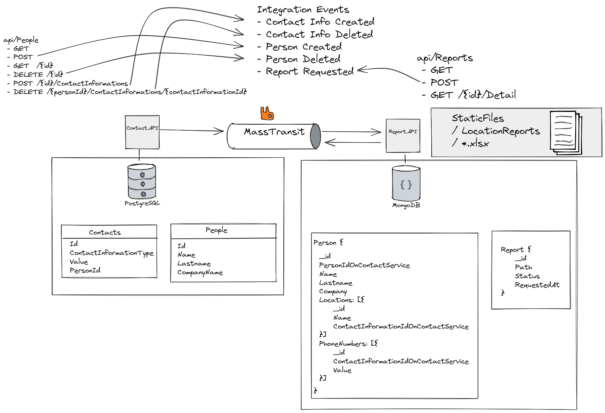

## How to Start

Change configurations on appsettings.json file on Contact.API

```
"ConnectionStrings": {
    "ContactDb": "[Your postgresql connectiong string for contact service database]"
  },
"RabbitMQ": {
    "Host": "[RabbitMQ Host Adress]"
},
```

Change configurations on appsettings.json file on Report.API

```
"ReportDatabaseSettings": {
    "PeopleCollectionName": "People",
    "ReportsCollectionName": "Reports",
    "ConnectionString": "[MongoDB Adress]",
    "DatabaseName": "[MongoDB Database Name]"
  },
 "RabbitMQ": {
    "Host": "[RabbitMQ Host Adress]"
 },
```

```
dotnet run --project .\src\Services\Contact\Contact.API\Contact.API.csproj
dotnet run --project .\src\Services\Report\Report.API\Report.API.csproj
```

Check swagger documentation

```
Contact.API - https://localhost:7064/swagger/index.html
Report.API - https://localhost:7289/swagger/index.html
```

## Technologies

* MassTransit
* Entity Framework Core
* PostgreSQL
* MongoDB
* MediatR
* FluentValidation
* FluentAssertions
* Moq
* EPPlus (for generating excel files)
* Bogus

## Architecture Overview

